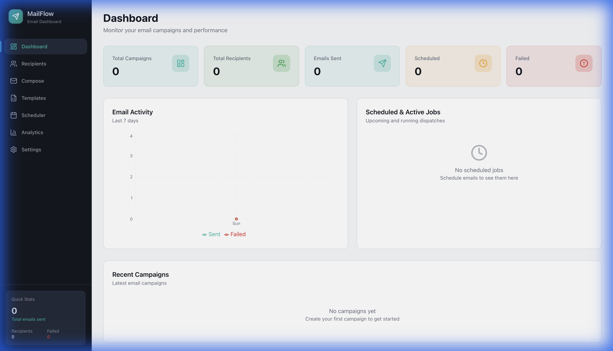
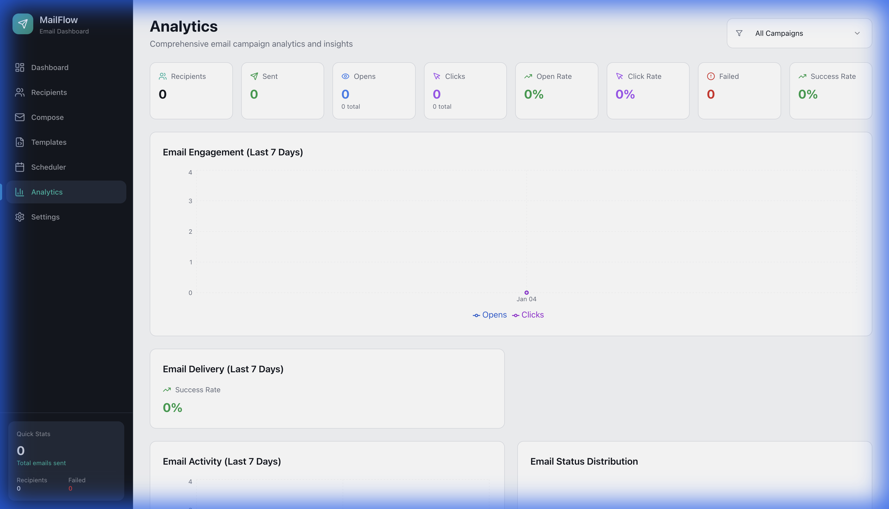
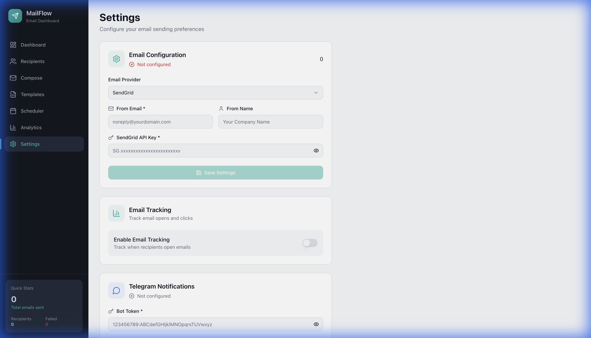

# 📧 Mail Muse

**Mail Muse** is a sleek, powerful, and self-hosted email marketing platform designed for simplicity and flexibility. Send beautiful campaigns using your own infrastructure or popular email providers.

## 🖼️ UI Screenshots

| Dashboard | Analytics |
|:---:|:---:|
|  |  |

| Settings |
|:---:|
|  |

## ✨ Features

### 🎨 Premium UI/UX
- **Futuristic Aesthetic**: Modern dark-themed design with vibrant accents and glassmorphism.
- **Micro-animations**: Smooth transitions and hover effects using Framer Motion.
- **Responsive Layout**: Fully adaptive interface for desktop and tablet views.
- **Dynamic Charts**: Interactive data visualization powered by Recharts.

### 🔌 Multi-Provider Support
- **SendGrid**: Integrated API delivery with tracking.
- **Mailgun**: High-deliverability API support.
- **Custom SMTP**: Support for Gmail, Outlook, or your own mail servers.
- **Conditional Configuration**: Dynamic forms that adapt to your chosen provider.

### 📊 Campaign Management & Analytics
- **Template Builder**: Create reusable HTML templates with dynamic variable support (`{{name}}`, `{{email}}`).
- **Scheduling**: Plan your campaigns and let the system handle background delivery.
- **Real-time Stats**: Track total campaigns, recipients, successful sends, and failures.
- **Granular Filtering**: Filter analytics data by specific campaigns to measure individual performance.

### 🤖 Automation & Notifications
- **Telegram Integration**: Receive instant alerts on your mobile device when campaigns finish.
- **Background Jobs**: Robust job queue management for reliable email dispatch.

## 🚀 Quick Start

### Prerequisites
- Node.js (v18 or higher)
- npm or yarn

### Installation

1. **Clone the repository**:
   ```bash
   git clone https://github.com/yourusername/mail-muse.git
   cd mail-muse
   ```

2. **Install dependencies**:
   ```bash
   npm install
   ```

3. **Set up environment variables**:
   Create a `.env` file in the root directory:
   ```env
   PORT=3001
   ```

4. **Start the application**:
   ```bash
   npm run dev:all
   ```
   This will start both the Express backend and the Vite frontend concurrently.

## 🛠️ Tech Stack

- **Frontend**: React, TypeScript, Vite, Tailwind CSS, Shadcn UI, Framer Motion.
- **Backend**: Node.js, Express.
- **Database**: SQLite (via `better-sqlite3`).
- **Mailing**: Nodemailer (SMTP), Axios (SendGrid/Mailgun APIs).

## 📖 Documentation

- [Hosting Guide](HOSTING.md) - How to host on Ubuntu 24.04.
- [Deployment Guide](DEPLOYMENT.md) - Step-by-step deployment instructions.

## 📄 License

MIT License - feel free to use and modify for your own projects!
